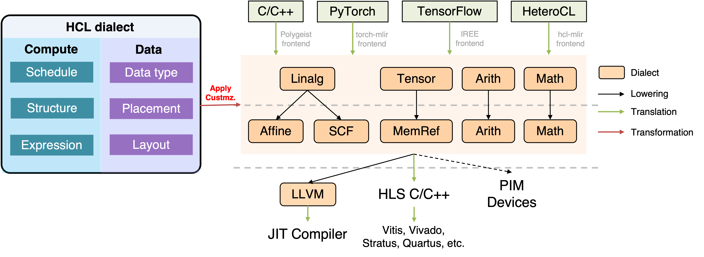

<!--- Copyright HeteroCL authors. All Rights Reserved. -->
<!--- SPDX-License-Identifier: Apache-2.0  -->

# HeteroCL Dialect

## Overview



HeteroCL dialect is an out-of-tree [MLIR](https://mlir.llvm.org/) dialect for accelerator design. HeteroCL dialect decouples algorithm from hardware customizations, and classifies them into compute and data customizations. The HeteroCL dialect is part of the [HeteroCL](https://github.com/cornell-zhang/heterocl) compilation flow. HeteroCL provides an end-to-end flow from Python to LLVM backend or C HLS FPGA backends. With HeteroCL, designers can explore tradeoffs with hardware customizations in a systematic manner and quickly obtain high-performance design with little manual effort.


## Building

### Preliminary tools
- gcc >= 5.4
- cmake >= 3.19
- python >= 3.7

### Install LLVM 15.0.0
- Download LLVM from [llvm-project](https://github.com/llvm/llvm-project/releases/tag/llvmorg-15.0.0) or checkout the Github branch
```sh
git clone https://github.com/llvm/llvm-project.git
cd llvm-project
git checkout tags/llvmorg-15.0.0
```

- Build
   - Without Python binding
   ```sh
   mkdir build && cd build
   cmake -G "Unix Makefiles" ../llvm \
      -DLLVM_ENABLE_PROJECTS=mlir \
      -DLLVM_BUILD_EXAMPLES=ON \
      -DLLVM_TARGETS_TO_BUILD="X86" \
      -DCMAKE_BUILD_TYPE=Release \
      -DLLVM_ENABLE_ASSERTIONS=ON \
      -DLLVM_INSTALL_UTILS=ON
   make -j8
   ```
   - With Python binding: Please follow the [official guide](https://mlir.llvm.org/docs/Bindings/Python/#generating-_dialect_namespace_ops_genpy-wrapper-modules) to set up the environment. In the following, we set up a virtual environment called `hcl-dev` using Python venv, but we prefer you to install Anaconda3 and create an environment there. If you want to use your own Python environment, please specify the path for `-DPython3_EXECUTABLE`.
   ```sh
   # Create a virtual environment. Make sure you have installed Python3.
   which python3
   python3 -m venv ~/.venv/hcl-dev
   source ~/.venv/hcl-dev/bin/activate

   # It is recommended to upgrade pip
   python3 -m pip install --upgrade pip

   # Install required packages. Suppose you are inside the llvm-project folder.
   python3 -m pip install -r mlir/python/requirements.txt
   # for Python<=3.6, you need to install the following package
   python3 -m pip install contextvars

   # Run cmake
   mkdir build && cd build
   cmake -G "Unix Makefiles" ../llvm \
      -DLLVM_ENABLE_PROJECTS=mlir \
      -DLLVM_BUILD_EXAMPLES=ON \
      -DLLVM_TARGETS_TO_BUILD="host" \
      -DCMAKE_BUILD_TYPE=Release \
      -DLLVM_ENABLE_ASSERTIONS=ON \
      -DLLVM_INSTALL_UTILS=ON \
      -DMLIR_ENABLE_BINDINGS_PYTHON=ON \
      -DPython3_EXECUTABLE=`which python3`
   make -j8

   # Export the LLVM build directory
   export LLVM_BUILD_DIR=$(pwd)

   # To enable better backtracing for debugging,
   # we suggest setting the following system path
   export LLVM_SYMBOLIZER_PATH=$(pwd)/bin/llvm-symbolizer
   ```

### Build HeteroCL Dialect
This setup assumes that you have built LLVM and MLIR in `$LLVM_BUILD_DIR`. Please firstly clone our repository.
```sh
git clone --recursive git@github.com:cornell-zhang/hcl-dialect.git
cd hcl-dialect
mkdir build && cd build
```

> **_NOTE:_**  The HeteroCL dialect is a standalone system that works without a frontend. If you are using it with the HeteroCL frontend, the minimum requirement is to build with Python binding. Building with OpenSCoP extraction is optional.

- Build without Python binding
```sh
cmake -G "Unix Makefiles" .. \
   -DMLIR_DIR=$LLVM_BUILD_DIR/lib/cmake/mlir \
   -DLLVM_EXTERNAL_LIT=$LLVM_BUILD_DIR/bin/llvm-lit \
   -DPYTHON_BINDING=OFF \
   -DOPENSCOP=OFF
make -j8
```

- Build with Python binding
```sh
cmake -G "Unix Makefiles" .. \
   -DMLIR_DIR=$LLVM_BUILD_DIR/lib/cmake/mlir \
   -DLLVM_EXTERNAL_LIT=$LLVM_BUILD_DIR/bin/llvm-lit \
   -DPYTHON_BINDING=ON \
   -DOPENSCOP=OFF \
   -DPython3_EXECUTABLE=~/.venv/hcl-dev/bin/python3
make -j8

# Export the generated HCL-MLIR Python library
export PYTHONPATH=$(pwd)/tools/hcl/python_packages/hcl_core:${PYTHONPATH}
```

- Build with OpenSCoP extraction enabled: Set `-DOPENSCOP=ON` and export the library path.
```sh
export LD_LIBRARY_PATH=$(pwd)/openscop/lib:$LD_LIBRARY_PATH
```


Lastly, you can use the following integration test to see whether your built dialect works properly.
```
cmake --build . --target check-hcl
```


## Run HeteroCL Dialect
```sh
# perform loop transformation passes
./bin/hcl-opt -opt ../test/Transforms/compute/tiling.mlir

# generate C++ HLS code
./bin/hcl-opt -opt ../test/Transforms/compute/tiling.mlir | \
./bin/hcl-translate -emit-vivado-hls

# generate OpenSCoP
# An hcl.openscop file will be generated in the build folder
./bin/hcl-opt -opt ../test/Transforms/memory/buffer_add.mlir | \
./bin/hcl-translate --extract-scop-stmt

# run code on CPU
./bin/hcl-opt -opt -jit ../test/Translation/mm.mlir
```


## Integrate with upstream HeteroCL frontend
Make sure you have correctly built the above HCL-MLIR dialect, and follow the instruction below.

```sh
# clone the HeteroCL repo
git clone https://github.com/cornell-zhang/heterocl.git heterocl-mlir
cd heterocl-mlir

# install dependencies
python3 -m pip install -r python/requirements.txt

# export the library
export HCL_HOME=$(pwd)
export PYTHONPATH=$HCL_HOME/python:${PYTHONPATH}

# run regression tests in the HeteroCL repo
cd tests && python3 -m pytest
```

## HeteroCL Dialect Examples


## Coding Style

We follow [Google Style Guides](https://google.github.io/styleguide/) and use
* [clang-format](https://clang.llvm.org/docs/ClangFormat.html) for C/C++
* [black](https://github.com/psf/black) and [pylint](https://pylint.org/) for Python


## References
* [ScaleHLS](https://github.com/hanchenye/scalehls)
* [Torch-MLIR](https://github.com/llvm/torch-mlir)
* [Polymer](https://github.com/kumasento/polymer)
